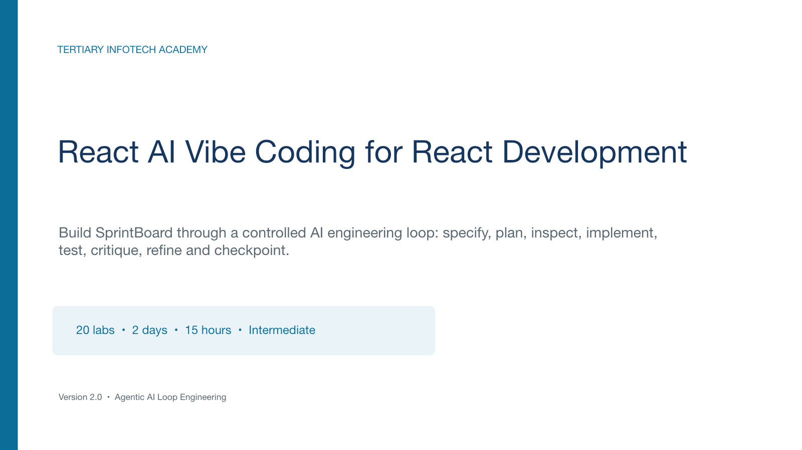

# C1143 — AI Vibe Coding for React Development

[](https://www.tertiarycourses.com.sg/ai-vibe-coding-for-react-development.html)
[](#course-structure)
[](#course-structure)

Professional non-WSQ courseware for a two-day, hands-on React development course using Agentic AI Loop Engineering and an evidence-led acceptance workflow.

## Preview



## About

Learners build one connected capstone, **SprintBoard**, across 20 progressive labs. They scaffold a Vite React TypeScript project, compose accessible UI, add state/hooks/routing/API data, then debug, test, optimize, and deploy the app. Every lab applies the agentic loop: Frame → Plan → Generate → Inspect → Verify → Correct → Commit.

## Course structure

| Item | Detail |
|---|---|
| Course code | C1143 |
| Duration | 15 instructional hours / 2 days |
| Level | Intermediate |
| Capstone | SprintBoard React single-page application |
| Published outline | [Tertiary Courses course page](https://www.tertiarycourses.com.sg/ai-vibe-coding-for-react-development.html) |

## Deliverables

- 142-slide, 16:9 facilitator deck
- 110+ page Learner Guide plus aligned Markdown
- Word Lesson Plan with aligned 900-minute schedule
- 20 connected, executable labs
- Project-scoped `non-wsq-*` generation and QA automation

## Project structure

```text
courseware/
  C1143-Facilitator-Deck.pptx
  C1143-Facilitator-Deck-Visual-Enhanced.pptx
  C1143-Learner-Guide.docx
  C1143-Learner-Guide.md
  C1143-Lesson-Plan.docx
  QA-REPORT.md
labs/
  topic-1/ ... topic-4/ (20 labs)
scripts/
  non-wsq-course-data.py
  non-wsq-build-courseware.py
  non-wsq-build-presentation.mjs
  enhance_deck_visuals.py
.claude/
  agents/ commands/ hooks/
```

## Regenerate

Run the document generator with Python 3 and `python-docx`. The presentation generator uses the bundled OpenAI artifact tool runtime. Generated artifacts are written to `courseware/`.

## Quality controls

The package checks artifact completeness, duration alignment, topic order, all 15 required lab sections, prohibited programme language, naming isolation, secret exposure, and rendered visual quality.

## Credits

Courseware produced for [Tertiary Infotech Academy Pte Ltd](https://www.tertiaryinfotech.com/). Source outline: [AI Vibe Coding for React Development](https://www.tertiarycourses.com.sg/ai-vibe-coding-for-react-development.html).
